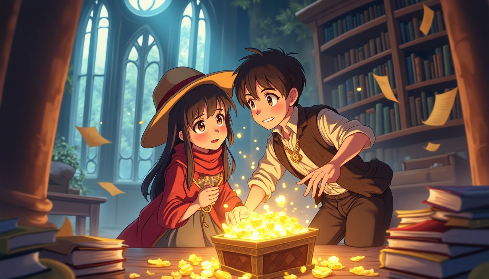
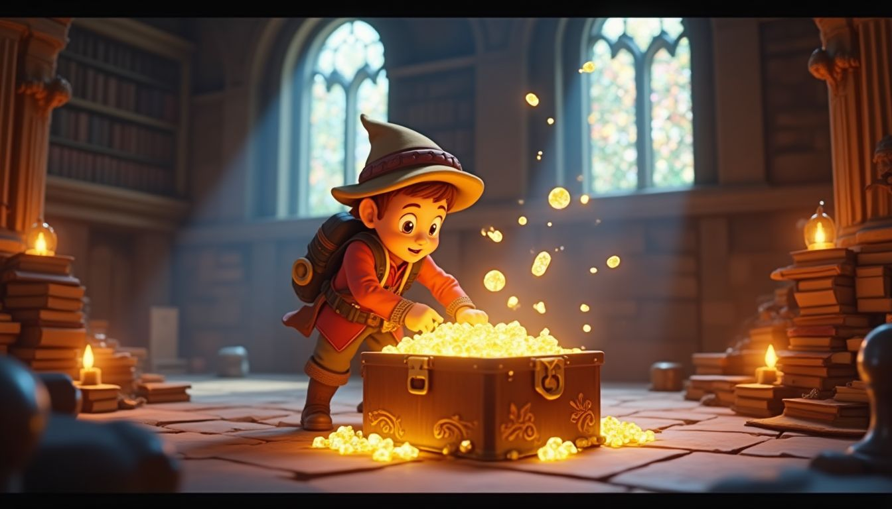
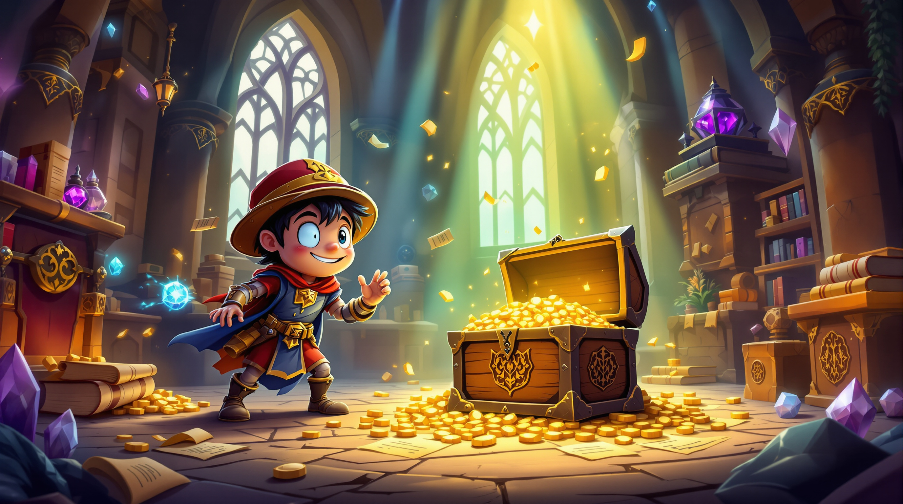
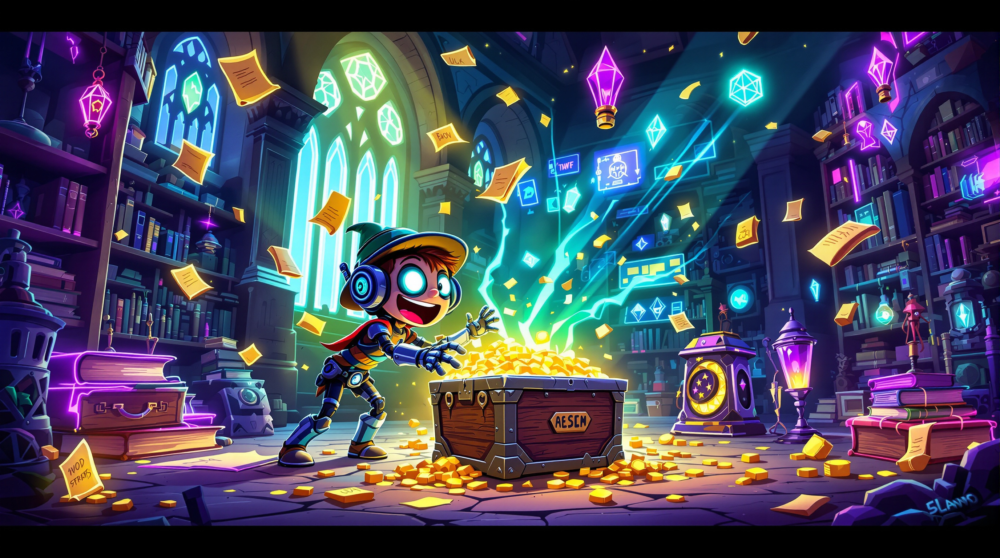
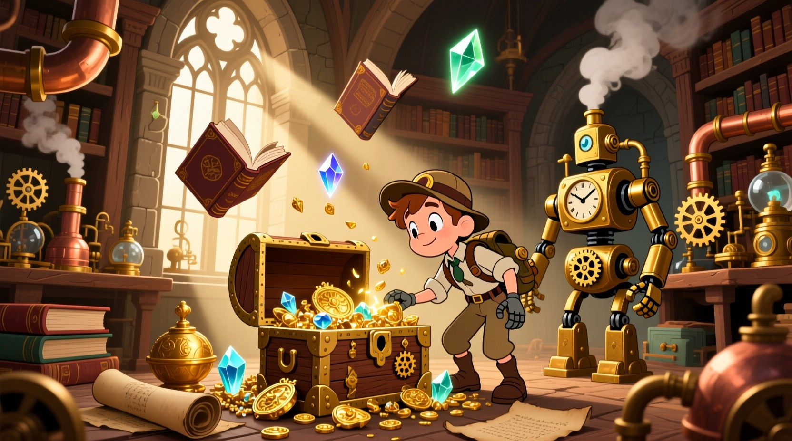

# Illustration Style Samples 🎨

> **A comprehensive comparison of AI image generation models across 17 different cartoon and illustration styles**

This open-source repository showcases the visual capabilities of leading AI image generation models, tested across a diverse range of illustration styles. Our systematic testing provides developers, artists, and researchers with concrete examples to make informed decisions about which model best suits their creative projects.

## 🚀 Featured Models

We tested **4 state-of-the-art AI models** across **17 distinct illustration styles**:

| Model | Company | Aspect Ratio Support | Speed | Quality |
|-------|---------|---------------------|-------|---------|
| **Flux Dev** | Black Forest Labs | ✅ 16:9 | ⚡ Fast | 🔥 High |
| **Flux 1.1 Pro Ultra** | Black Forest Labs | ✅ 16:9 | 🐌 Slower | 🌟 Premium |
| **Qwen Image** | Alibaba | ✅ 16:9 | ⚡ Fast | 💎 Excellent |
| **Nano Banana** | Google | ❌ Square only | ⚡⚡ Very Fast | 🎯 Consistent |

## 🎯 Test Scenario

**Consistent Prompt Used Across All Models:**

> *"An exciting cartoon adventure scene featuring a brave young explorer discovering a hidden treasure chest in an ancient mystical library. The scene shows floating magical books, glowing crystals, ornate golden treasures spilling from an old wooden chest, with mystical light beams streaming through tall arched windows. Ancient scrolls and mysterious artifacts are scattered around, creating an atmosphere of wonder and discovery."*

## 🎨 17 Illustration Styles Tested

1. **3D Rendered Cartoon** - Pixar-like volumetric rendering
2. **Anime** - Japanese animation style with large expressive eyes
3. **Chibi** - Cute miniaturized Japanese art style
4. **Comic Book** - American superhero comic aesthetic
5. **Cyberpunk Cartoon** - Futuristic neon-lit tech noir
6. **Fantasy Cartoon** - Magical medieval adventure style
7. **Flat Illustration** - Clean geometric vector art
8. **Minimalist Cartoon** - Simple shapes and limited color palette
9. **Noir Cartoon** - Film noir detective story aesthetic
10. **Pastel Goth** - Dark themes with soft romantic colors
11. **Pixar Style** - Professional 3D animation rendering
12. **Pop Art** - Andy Warhol inspired bold graphics
13. **Rubber Hose** - 1930s classic animation style
14. **Sketch Cartoon** - Hand-drawn pencil sketch appearance
15. **Steampunk Cartoon** - Victorian brass and copper machinery
16. **Surreal Cartoon** - Salvador Dalí inspired dream-like imagery
17. **Watercolor Cartoon** - Traditional paint with bleeding colors

## 📖 Complete Style Descriptions

**Want the full copyable prompts for each style?** 

👉 **[View Complete Style Guide](./docs/style-descriptions.md)** - Get detailed, copyable style descriptions for all 17 illustration styles

Each style includes:
- ✅ **Complete copyable prompt** - Ready to use with any AI model
- 🎨 **Detailed style characteristics** - Understand exactly what makes each style unique  
- 💡 **Usage tips** - Get the best results from your chosen style
- 🔧 **Customization notes** - Adapt the styles for your specific needs

Perfect for artists, developers, and creators who want to replicate these styles with their own content!

## 📊 Sample Results

Here are representative samples from each model. Click on the model name to view all 17 style variations:

### [🔥 Flux Dev Results](./docs/flux-dev-results.md)
*High-quality, fast generation with excellent 16:9 aspect ratio support*

| 3D Rendered | Anime | Pixar Style |
|-------------|-------|-------------|
|  |  |  |

### [⭐ Flux 1.1 Pro Ultra Results](./docs/flux-ultra-results.md)
*Premium quality with superior detail and artistic refinement*

| Fantasy | Cyberpunk | Watercolor |
|---------|-----------|------------|
|  |  |  |

### [🎯 Qwen Image Results](./docs/qwen-results.md) 
*Consistent quality with excellent style interpretation*

| Comic Book | Steampunk | Pop Art |
|------------|-----------|---------|
|  |  |  |

### [⚡ Nano Banana Results](./docs/nano-banana-results.md)
*Fast generation with unique artistic interpretation (square format only)*

| Noir | Minimalist | Sketch |
|------|------------|--------|
|  |  |  |  

## 🛠️ Run Your Own Tests

Want to test these models with your own prompts? This repository includes the complete testing framework!

### Prerequisites

1. **Python 3.8+** with pip
2. **Replicate API Account** - [Sign up here](https://replicate.com/)
3. **replicate-batch-process** - Our open-source batch processing library

### Quick Setup

```bash
# Clone this repository
git clone https://github.com/preangelleo/illustration-style-samples.git
cd illustration-style-samples

# Install dependencies
pip install python-dotenv
pip install git+https://github.com/preangelleo/replicate-batch-process.git

# Configure your API credentials
cp .env.example .env
# Edit .env and add your REPLICATE_API_TOKEN

# Run compatibility test first
python illustration_styles_generator.py --compatibility-only

# Run full test (68 images across 4 models)
python illustration_styles_generator.py --skip-compatibility
```

### 💡 Test Options

- `--compatibility-only` - Test each model with one style to verify setup
- `--skip-compatibility` - Run full test immediately 
- Default - Run compatibility test, then ask for confirmation

### Expected Costs 💰

| Test Type | Images Generated | Estimated Cost* |
|-----------|------------------|----------------|
| Compatibility | 4 images | ~$0.20 |
| Full Test | 68 images | ~$3.50 |

*Costs vary by model. Flux models are more expensive but higher quality.

## 🔬 Technical Details

### Test Configuration
- **Concurrent Requests:** 300 (maximum throughput)
- **Aspect Ratio:** 16:9 for supported models, 1:1 for Nano Banana
- **Output Format:** JPEG, high quality
- **Timeout:** 60 seconds per image
- **Retry Logic:** 3 attempts with intelligent fallback

### Performance Metrics
Our tests measured:
- **Generation Speed:** Images per second
- **Success Rate:** Percentage of successful generations
- **Quality Consistency:** Visual coherence across styles
- **Style Adherence:** How well models follow style descriptions

## 📚 Built With replicate-batch-process

This project showcases our open-source **[replicate-batch-process](https://github.com/preangelleo/replicate-batch-process)** library:

- ⚡ **Intelligent Concurrency** - Automatic rate limiting and batch optimization
- 🔄 **Smart Retry Logic** - Handles failures with model fallbacks
- 📊 **Real-time Monitoring** - Live progress tracking and performance metrics
- 🎯 **Precise File Naming** - No more mixed-up results in batch operations
- 🌐 **Global Rate Limiting** - Respects API limits across multiple processes

### Key Features Used:
```python
from replicate_batch_process.intelligent_batch_processor import intelligent_batch_process

# Batch process with intelligent concurrency
files = await intelligent_batch_process(
    prompts=prompts,
    model_name="black-forest-labs/flux-dev",
    max_concurrent=300,
    output_filepath=output_filepaths,  # Precise naming!
    aspect_ratio="16:9",
    guidance=3.0
)
```

## 🤝 Contributing

We welcome contributions to improve this testing framework:

1. **Add New Models** - Submit PRs with new model configurations
2. **Expand Style Library** - Create new illustration style definitions
3. **Improve Documentation** - Help make results more accessible
4. **Report Issues** - Found inconsistencies? Open an issue!

## 📈 Results Analysis

Our systematic testing revealed:

- **Best Overall Quality:** Flux 1.1 Pro Ultra
- **Best Speed/Quality Balance:** Flux Dev  
- **Most Consistent:** Qwen Image
- **Fastest Generation:** Nano Banana
- **Best Style Versatility:** Flux models
- **Most Artistic Interpretation:** Qwen Image

## 📜 License

This project is licensed under the MIT License - see the [LICENSE](LICENSE) file for details.

## 🙋‍♀️ Support

- **Style Guide:** [Complete Style Descriptions](./docs/style-descriptions.md) - Copyable prompts for all 17 styles
- **Documentation:** Check individual model result pages
- **Issues:** [GitHub Issues](https://github.com/preangelleo/illustration-style-samples/issues)
- **Library Support:** [replicate-batch-process Issues](https://github.com/preangelleo/replicate-batch-process/issues)

---

**⭐ If this comparison helped you choose the right AI model, please star this repository!**

*Last updated: $(date)*
*Test Version: 1.0.0*
*Models tested: 4 | Styles evaluated: 17 | Images generated: 68*