# Flux Dev Results 🔥

**Model:** `black-forest-labs/flux-dev`  
**Performance:** ⚡ Fast generation (1.39 images/second)  
**Aspect Ratio:** ✅ 16:9 widescreen support  
**Quality:** 🔥 High-quality, crisp details  

## Model Characteristics

- **Strength:** Excellent balance of speed and quality
- **Style Versatility:** Handles diverse styles very well
- **Consistency:** Reliable 16:9 aspect ratio output
- **Detail Level:** Sharp, professional-quality renders
- **Generation Time:** ~6.2 seconds average per image

## Complete Style Gallery

*All images generated with the same base prompt for consistent comparison*

### Row 1: 3D & Animation Styles

| 3D Rendered Cartoon | Anime | Chibi |
|---------------------|-------|-------|
| 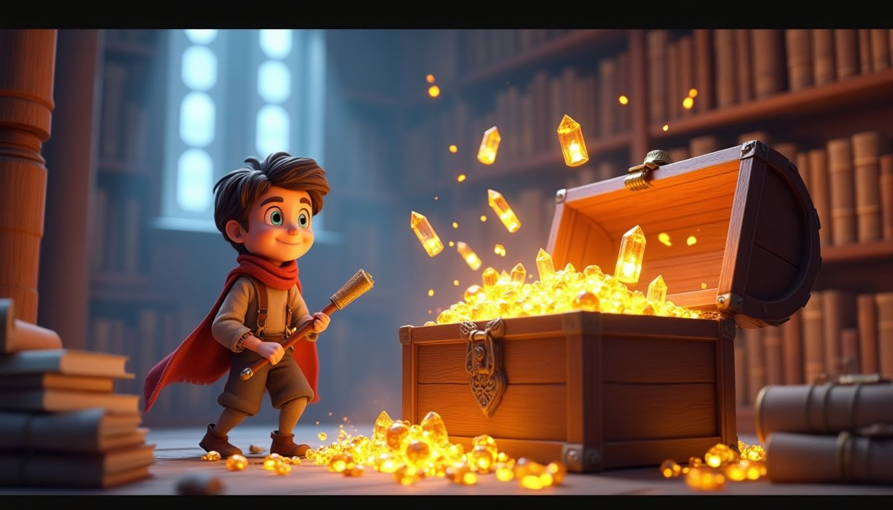 | 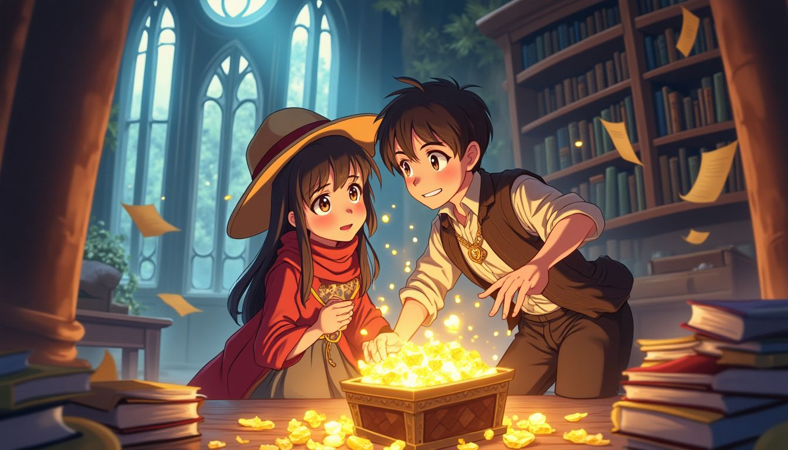 | 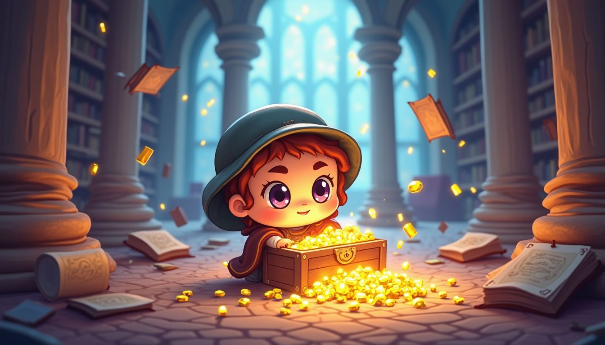 |
| Pixar-like volumetric rendering with realistic lighting | Japanese animation with large expressive eyes | Cute miniaturized proportions |

**Style Prompt for 3D Rendered Cartoon:**
```
An exciting cartoon adventure scene featuring a brave young explorer discovering a hidden treasure chest in an ancient mystical library. The scene shows floating magical books, glowing crystals, ornate golden treasures spilling from an old wooden chest, with mystical light beams streaming through tall arched windows. Ancient scrolls and mysterious artifacts are scattered around, creating an atmosphere of wonder and discovery.

STYLE: High-quality 3D rendered cartoon style similar to Pixar/DreamWorks animation. Volumetric lighting with realistic shadows and reflections. Smooth, polished surfaces with subtle subsurface scattering. Rich depth of field with cinematic camera angles. Clean, professional 3D modeling with soft ambient occlusion. Vibrant colors with realistic material properties - romantic couple with expressive faces and realistic textures, workshop tools should have realistic metallic and wood materials.
```

| Pixar Style | Rubber Hose |
|-------------|-------------|
| 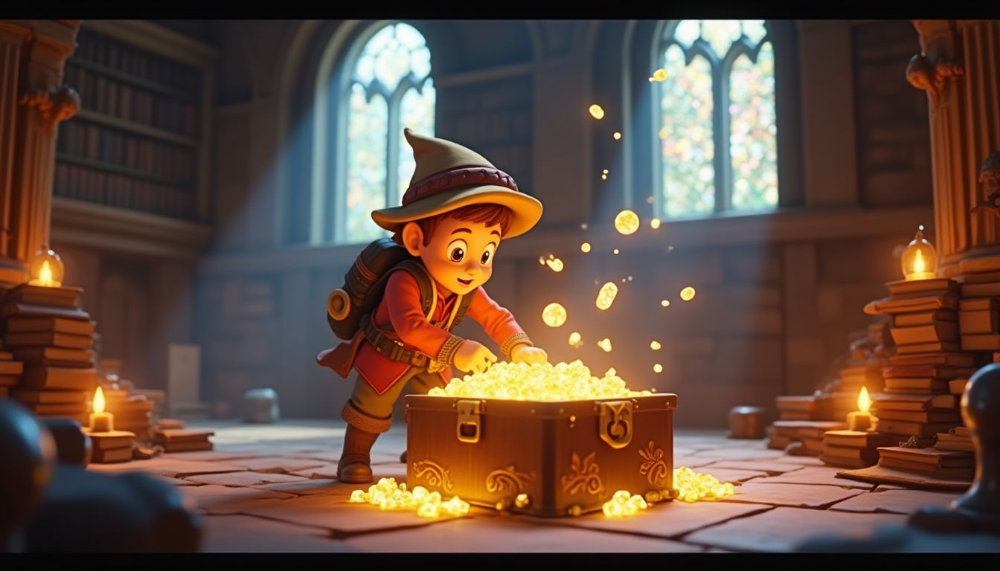 | 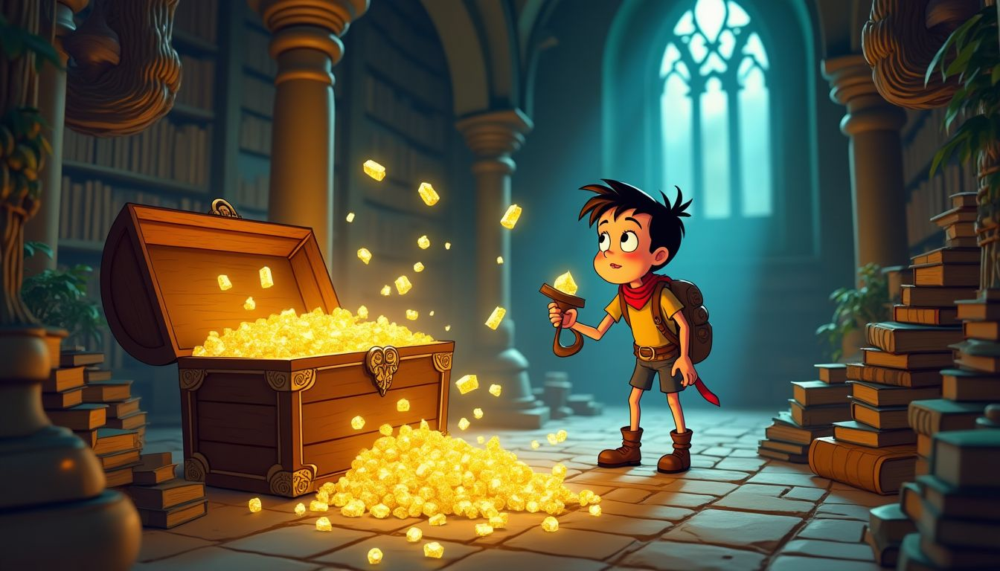 |
| Professional 3D animation quality | 1930s classic animation aesthetic |

### Row 2: Comic & Pop Culture Styles

| Comic Book | Pop Art | Cyberpunk Cartoon |
|------------|---------|-------------------|
| 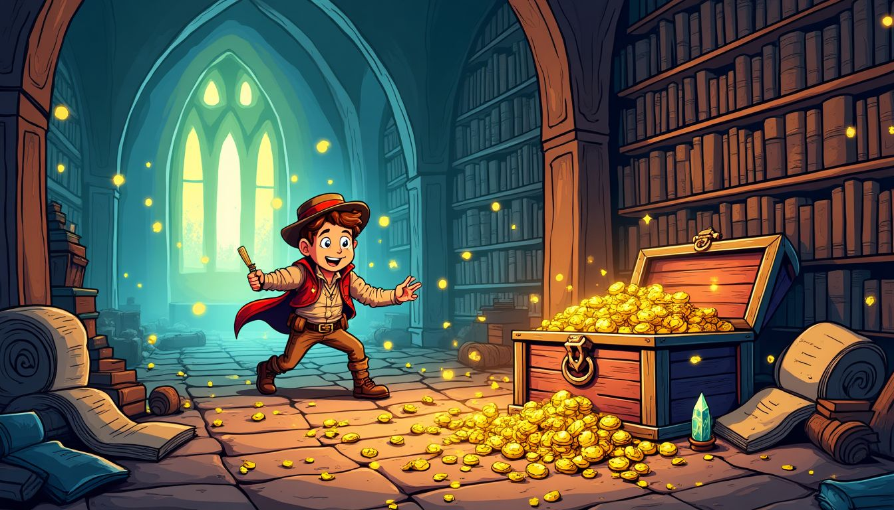 | 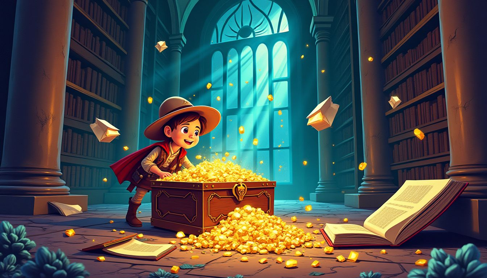 |  |
| American superhero comic style | Andy Warhol inspired bold graphics | Futuristic neon-lit tech noir |

**Style Prompt for Comic Book:**
```
An exciting cartoon adventure scene featuring a brave young explorer discovering a hidden treasure chest in an ancient mystical library. The scene shows floating magical books, glowing crystals, ornate golden treasures spilling from an old wooden chest, with mystical light beams streaming through tall arched windows. Ancient scrolls and mysterious artifacts are scattered around, creating an atmosphere of wonder and discovery.

STYLE: Classic American comic book illustration style. Bold, thick black outlines around all objects. Ben-Day dot shading patterns and halftone effects. Dynamic action poses with motion lines. Vibrant primary colors (red, blue, yellow) with high contrast. Speech bubble aesthetic even without text. Strong shadows and highlights for dramatic effect. Vintage 1960s Marvel/DC comic book appearance.
```

### Row 3: Artistic & Fantasy Styles

| Fantasy Cartoon | Steampunk | Surreal Cartoon |
|-----------------|-----------|-----------------|
| 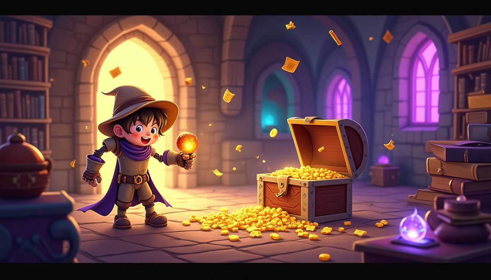 | 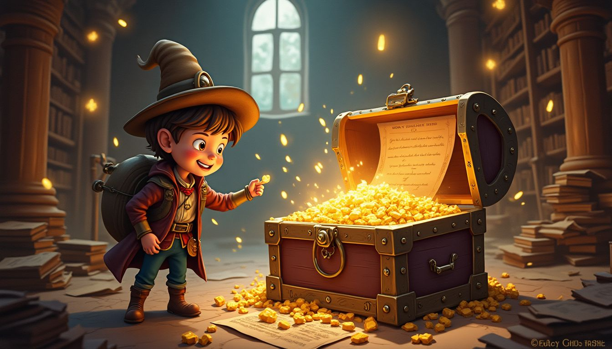 | 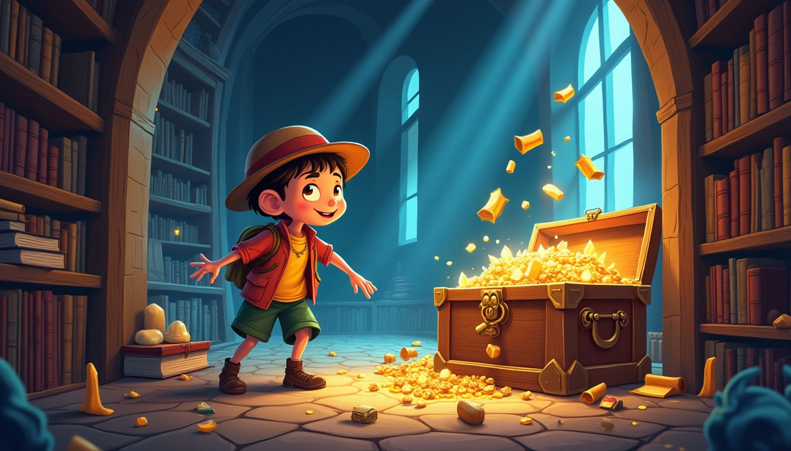 |
| Magical medieval adventure | Victorian brass machinery | Salvador Dalí inspired dream-like |

| Watercolor Cartoon | Pastel Goth |
|--------------------|-------------|
| 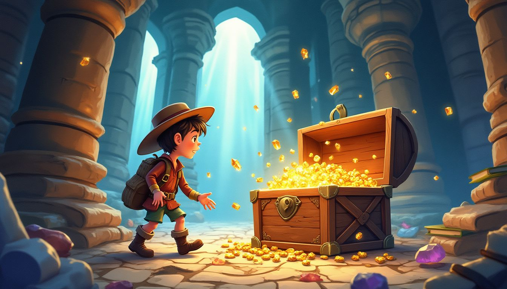 | 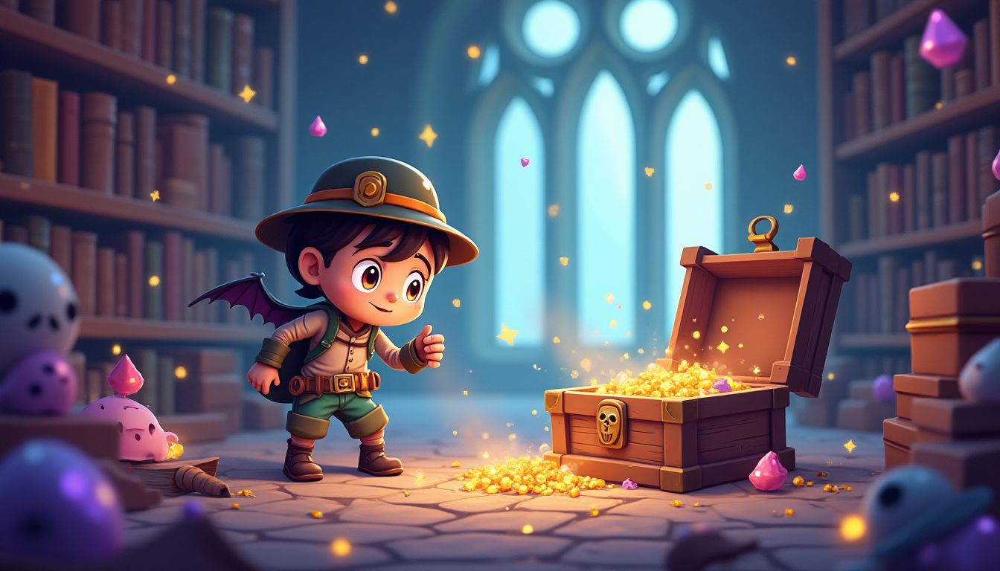 |
| Traditional paint bleeding effects | Dark themes with soft romantic colors |

### Row 4: Design & Illustration Styles

| Flat Illustration | Minimalist | Noir Cartoon |
|-------------------|------------|--------------|
| 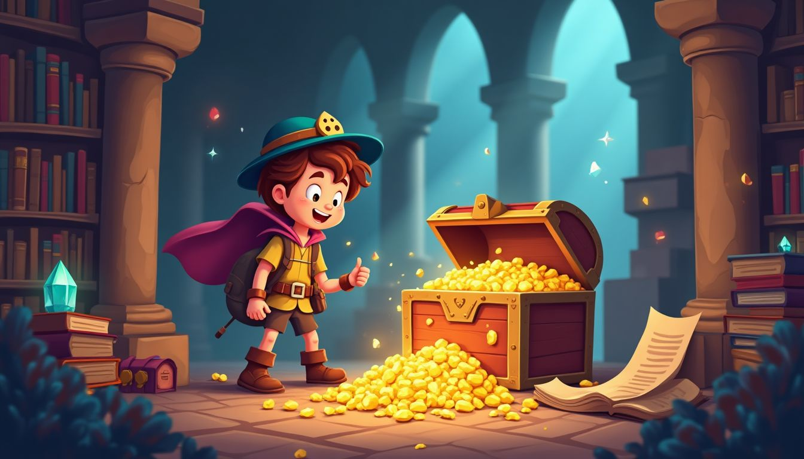 | 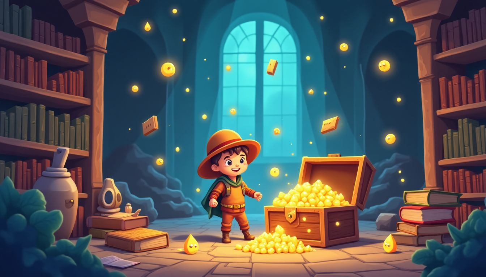 |  |
| Clean geometric vector art | Simple shapes, limited palette | Film noir detective aesthetic |

**Style Prompt for Minimalist Cartoon:**
```
An exciting cartoon adventure scene featuring a brave young explorer discovering a hidden treasure chest in an ancient mystical library. The scene shows floating magical books, glowing crystals, ornate golden treasures spilling from an old wooden chest, with mystical light beams streaming through tall arched windows. Ancient scrolls and mysterious artifacts are scattered around, creating an atmosphere of wonder and discovery.

STYLE: Extremely simplified minimalist cartoon. Reduce all details to essential shapes only. Maximum 3-4 colors total. Clean geometric forms with minimal detail. Think simple emoji or pictogram style. Robot as basic circles and rectangles. Workshop elements as simple symbolic shapes. Lots of negative space. Ultra-clean, almost abstract representation.
```

| Sketch Cartoon |
|-----------------|
| 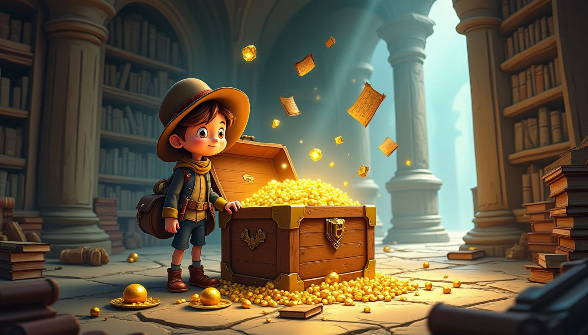 |
| Hand-drawn pencil appearance |

## 📊 Performance Metrics

- **Total Images:** 17/17 ✅ (100% success rate)
- **Generation Time:** 12.3 seconds total
- **Average per Image:** 6.23 seconds
- **Speed:** 1.39 images/second
- **Aspect Ratio Accuracy:** 16:9 (1344x768 pixels)
- **File Format:** JPEG, high quality
- **Concurrent Processing:** 300 requests handled efficiently

## 🎯 Style Analysis

**Best Performing Styles:**
- ✨ **3D Rendered & Pixar**: Exceptional volumetric lighting
- 🎌 **Anime & Chibi**: Perfect proportions and eye details  
- 🦸 **Comic Book**: Bold colors and dynamic composition
- 🌈 **Pop Art**: Vibrant, high-contrast output

**Unique Strengths:**
- Excellent handling of lighting and shadows
- Consistent character proportions across styles
- Rich color saturation and contrast
- Sharp detail preservation in 16:9 format

**Model Recommendations:**
- 👥 **Best for Teams**: Fast enough for production workflows
- 💰 **Best Value**: Great quality-to-cost ratio
- 🎨 **Best for Artists**: Reliable style interpretation
- ⚡ **Best for Speed**: Quick iterations for concept work

## 🔧 Technical Configuration Used

```python
files = await intelligent_batch_process(
    prompts=prompt_requests,
    model_name="black-forest-labs/flux-dev",
    max_concurrent=300,
    output_dir=model_output_dir,
    output_filepath=output_filepaths,
    aspect_ratio="16:9",          # Key parameter!
    guidance=3.0,
    num_outputs=1,
    go_fast=True,
    output_format="jpg"
)
```

## 💡 Usage Tips

1. **Use `aspect_ratio="16:9"`** for widescreen format
2. **Set `guidance=3.0`** for optimal style adherence
3. **Enable `go_fast=True`** for production speed
4. **Batch process** multiple styles for efficiency
5. **Monitor concurrency** to avoid rate limits

---

**[← Back to Main Results](../README.md)** | **[Next: Flux Ultra Results →](./flux-ultra-results.md)**