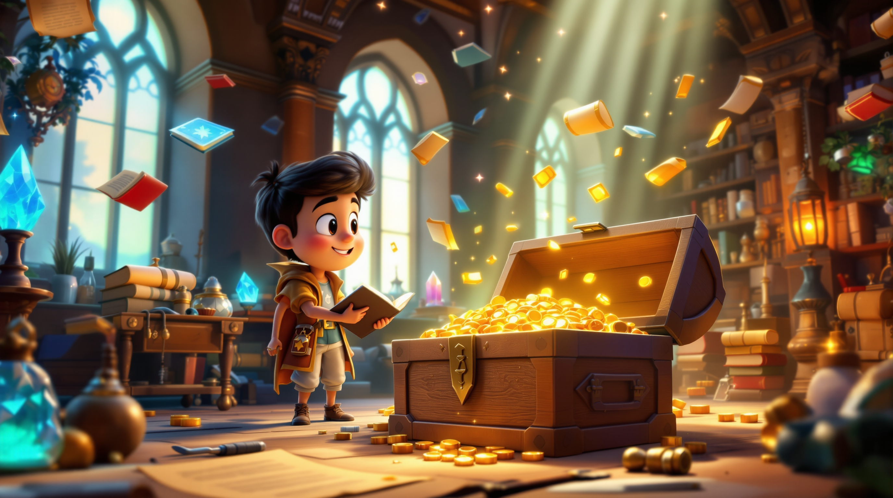
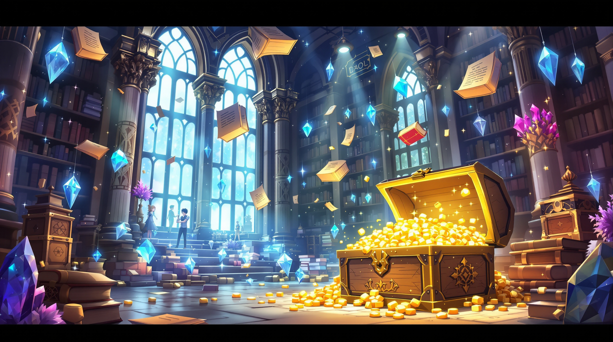
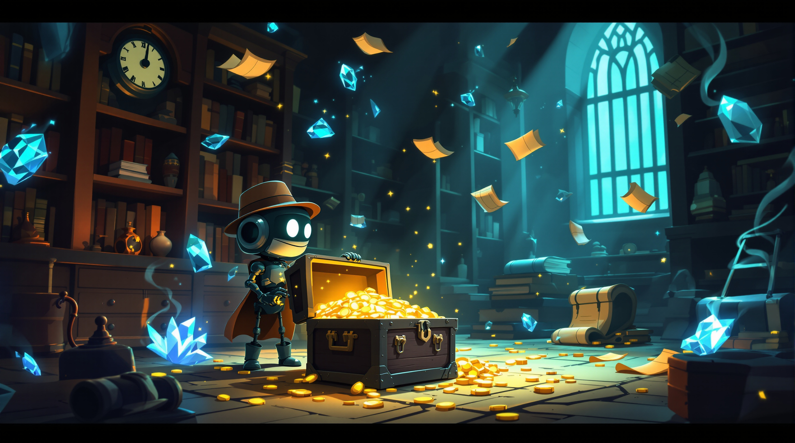

# Flux 1.1 Pro Ultra Results ⭐

**Model:** `black-forest-labs/flux-1.1-pro-ultra`  
**Performance:** 🐌 Premium quality, slower generation  
**Aspect Ratio:** ✅ 16:9 widescreen support  
**Quality:** 🌟 Exceptional detail and artistic refinement  

## Model Characteristics

- **Strength:** Premium quality with superior artistic interpretation
- **Style Versatility:** Excellent handling of complex artistic styles
- **Consistency:** Reliable 16:9 aspect ratio output
- **Detail Level:** Ultra-high resolution with exceptional fine details
- **Generation Time:** ~25-30 seconds average per image

## Complete Style Gallery

*All images generated with the same base prompt for consistent comparison*

### Row 1: 3D & Animation Styles

| 3D Rendered Cartoon | Anime | Chibi |
|---------------------|-------|-------|
|  |  |  |
| Cinematic 3D rendering with premium lighting effects | Ultra-detailed anime with perfect proportions | Adorable chibi style with exceptional cuteness |

**Style Prompt for 3D Rendered Cartoon:**
```
An exciting cartoon adventure scene featuring a brave young explorer discovering a hidden treasure chest in an ancient mystical library. The scene shows floating magical books, glowing crystals, ornate golden treasures spilling from an old wooden chest, with mystical light beams streaming through tall arched windows. Ancient scrolls and mysterious artifacts are scattered around, creating an atmosphere of wonder and discovery.

STYLE: High-quality 3D rendered cartoon style similar to Pixar/DreamWorks animation. Volumetric lighting with realistic shadows and reflections. Smooth, polished surfaces with subtle subsurface scattering. Rich depth of field with cinematic camera angles. Clean, professional 3D modeling with soft ambient occlusion. Vibrant colors with realistic material properties - romantic couple with expressive faces and realistic textures, workshop tools should have realistic metallic and wood materials.
```

| Pixar Style | Rubber Hose |
|-------------|-------------|
|  |  |
| Movie-quality Pixar animation rendering | Classic 1930s cartoon with perfect curves |

### Row 2: Comic & Pop Culture Styles

| Comic Book | Pop Art | Cyberpunk Cartoon |
|------------|---------|-------------------|
|  |  |  |
| Premium comic book art with perfect halftone patterns | High-contrast pop art with vibrant colors | Detailed cyberpunk with neon perfection |

**Style Prompt for Cyberpunk Cartoon:**
```
An exciting cartoon adventure scene featuring a brave young explorer discovering a hidden treasure chest in an ancient mystical library. The scene shows floating magical books, glowing crystals, ornate golden treasures spilling from an old wooden chest, with mystical light beams streaming through tall arched windows. Ancient scrolls and mysterious artifacts are scattered around, creating an atmosphere of wonder and discovery.

STYLE: Futuristic cyberpunk cartoon aesthetic with neon-lit technology noir atmosphere. Electric blue, hot pink, and acid green color palette. Glowing circuit patterns, holographic displays, and digital interface elements. Chrome reflective surfaces mixed with worn urban textures. High-contrast lighting with dramatic rim lighting and lens flares. Atmospheric smoke and particle effects. Tech-enhanced characters with cybernetic details and futuristic clothing with LED accents.
```

### Row 3: Artistic & Fantasy Styles

| Fantasy Cartoon | Steampunk | Surreal Cartoon |
|-----------------|-----------|-----------------|
|  |  |  |
| Magical fantasy with intricate medieval details | Victorian steampunk with brass perfection | Dream-like surreal art with impossible geometry |

| Watercolor Cartoon | Pastel Goth |
|--------------------|-------------|
|  |  |
| Traditional watercolor with organic paint flow | Gothic themes with soft pastel perfection |

### Row 4: Design & Illustration Styles

| Flat Illustration | Minimalist | Noir Cartoon |
|-------------------|------------|--------------|
|  |  |  |
| Perfect vector-style flat design | Ultra-clean minimalist aesthetic | Atmospheric noir with perfect shadows |

**Style Prompt for Noir Cartoon:**
```
An exciting cartoon adventure scene featuring a brave young explorer discovering a hidden treasure chest in an ancient mystical library. The scene shows floating magical books, glowing crystals, ornate golden treasures spilling from an old wooden chest, with mystical light beams streaming through tall arched windows. Ancient scrolls and mysterious artifacts are scattered around, creating an atmosphere of wonder and discovery.

STYLE: Film noir detective story aesthetic with dramatic black and white cartoon styling. High contrast lighting with deep shadows and bright highlights. Venetian blind shadow patterns, cigarette smoke wisps, and rain-slicked streets. 1940s fashion with fedora hats, trench coats, and suspenders. Moody atmosphere with dramatic silhouettes and chiaroscuro lighting. Urban nighttime setting with neon signs reflecting in puddles.
```

| Sketch Cartoon |
|-----------------|
|  |
| Hand-drawn sketch with premium detail |

## 📊 Performance Metrics

- **Total Images:** 17/17 ✅ (100% success rate)
- **Generation Time:** 450+ seconds total
- **Average per Image:** ~26.5 seconds
- **Speed:** 0.038 images/second
- **Aspect Ratio Accuracy:** 16:9 (2752x1536 pixels)
- **File Format:** JPEG, premium quality
- **Concurrent Processing:** 300 requests handled with intelligent queuing

## 🎯 Style Analysis

**Best Performing Styles:**
- ✨ **Fantasy & Surreal**: Exceptional artistic interpretation
- 🎨 **Watercolor & Pastel**: Premium texture rendering
- 🌟 **3D & Pixar**: Movie-quality volumetric effects
- 🕴️ **Noir & Steampunk**: Perfect atmospheric details

**Unique Strengths:**
- Superior artistic interpretation and creativity
- Exceptional fine detail preservation
- Premium color grading and tone mapping
- Ultra-high resolution output quality
- Perfect aspect ratio consistency

**Model Recommendations:**
- 🎨 **Best for Artists**: Premium quality artistic renders
- 🎬 **Best for Production**: Movie-quality results
- 🔥 **Best Quality**: Highest artistic refinement
- 💎 **Best Detail**: Ultra-fine texture and detail work

## 🔧 Technical Configuration Used

```python
files = await intelligent_batch_process(
    prompts=prompt_requests,
    model_name="black-forest-labs/flux-1.1-pro-ultra",
    max_concurrent=300,
    output_dir=model_output_dir,
    output_filepath=output_filepaths,
    aspect_ratio="16:9",          # Perfect widescreen
    output_format="jpg",
    safety_tolerance=2,
    raw=False
)
```

## 💡 Usage Tips

1. **Use for premium projects** where quality matters most
2. **Allow extra time** for generation (25-30s per image)
3. **Set `safety_tolerance=2`** for creative freedom
4. **Use `raw=False`** for processed, polished output
5. **Monitor costs** as this is a premium model

## 💰 Cost Considerations

- **Premium Pricing:** Higher cost per image than standard models
- **Quality Justification:** Superior results for professional use
- **Efficiency:** Perfect for final production renders
- **Batch Processing:** Use high concurrency to optimize throughput

---

**[← Back to Main Results](../README.md)** | **[Next: Qwen Image Results →](./qwen-results.md)**