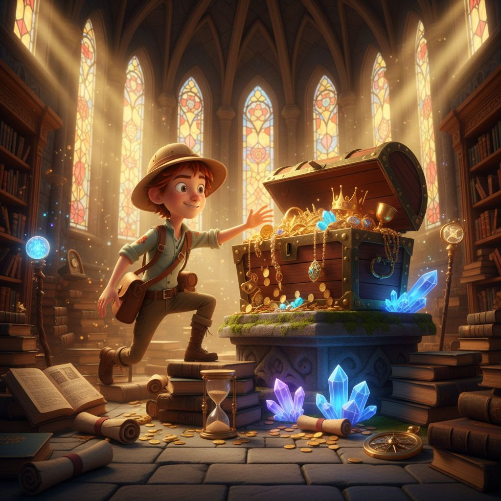
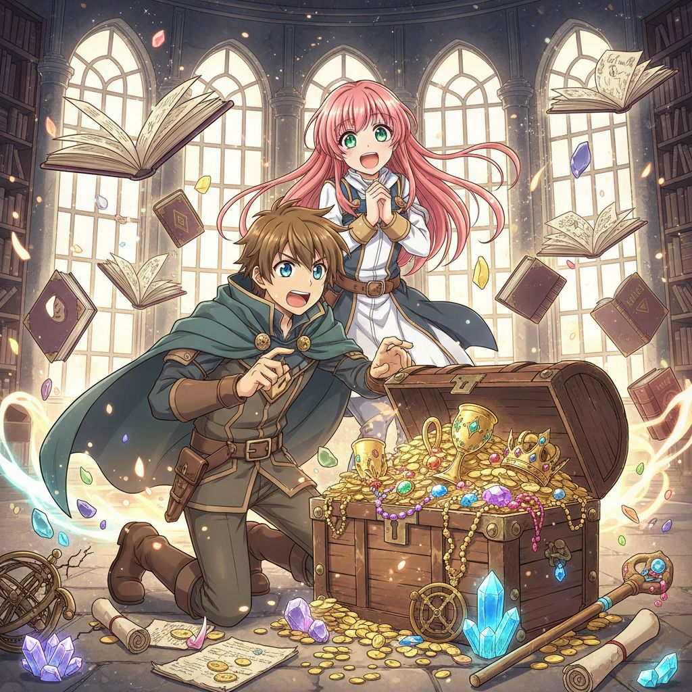
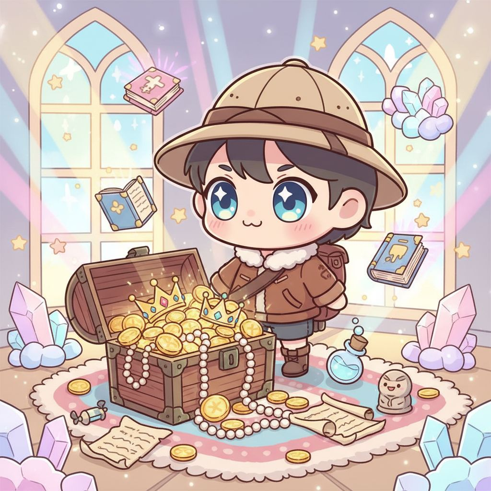
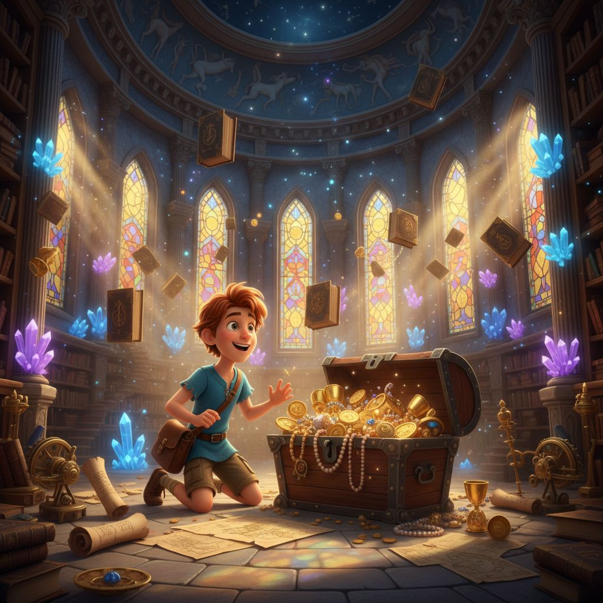
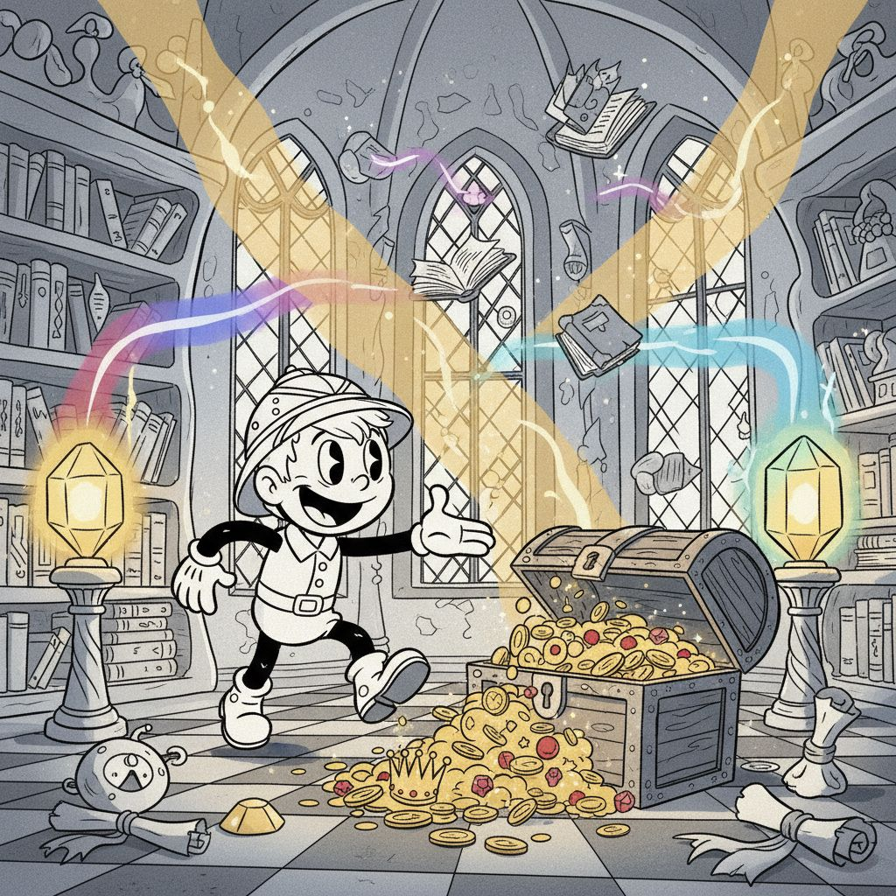
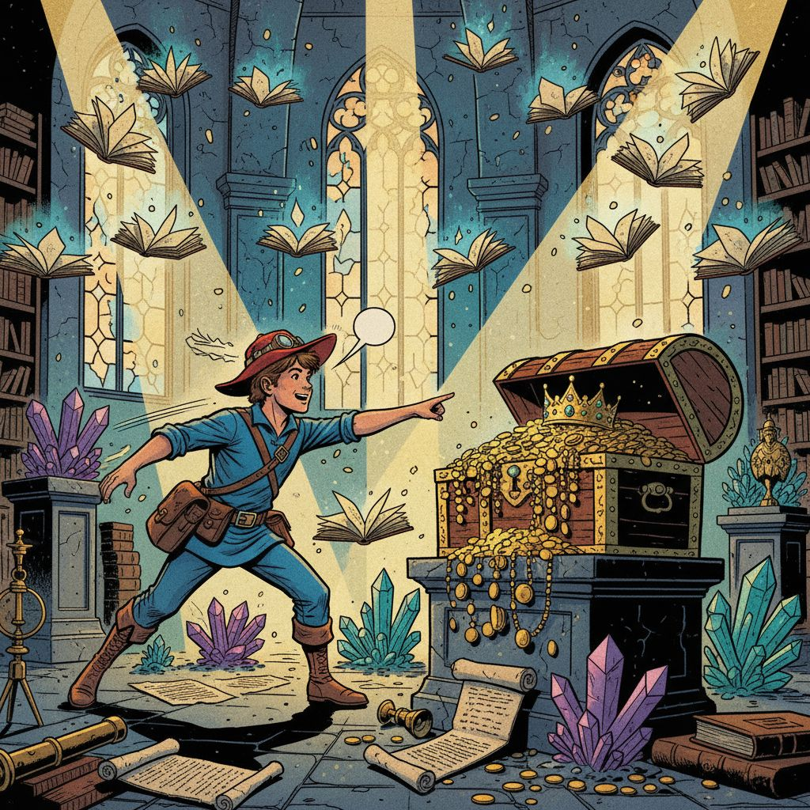
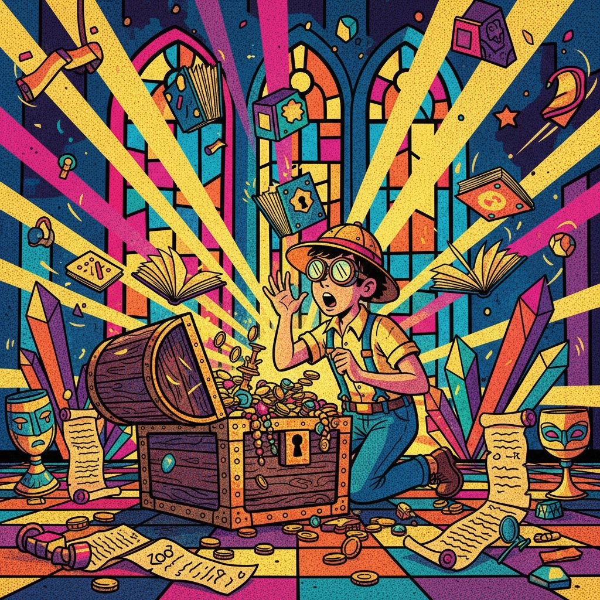
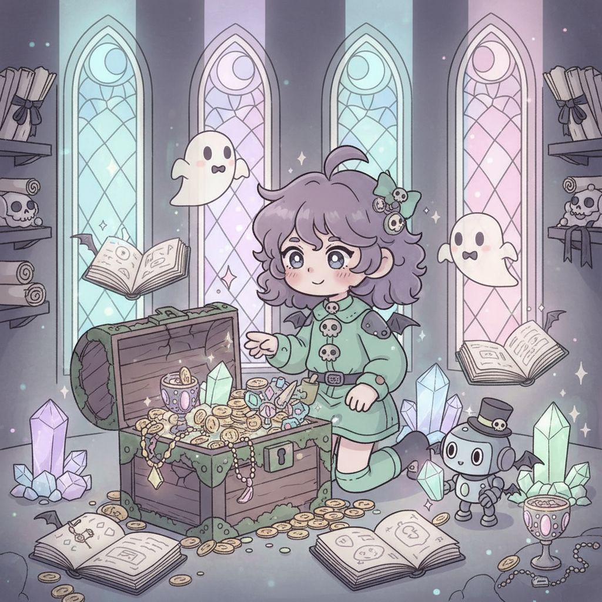
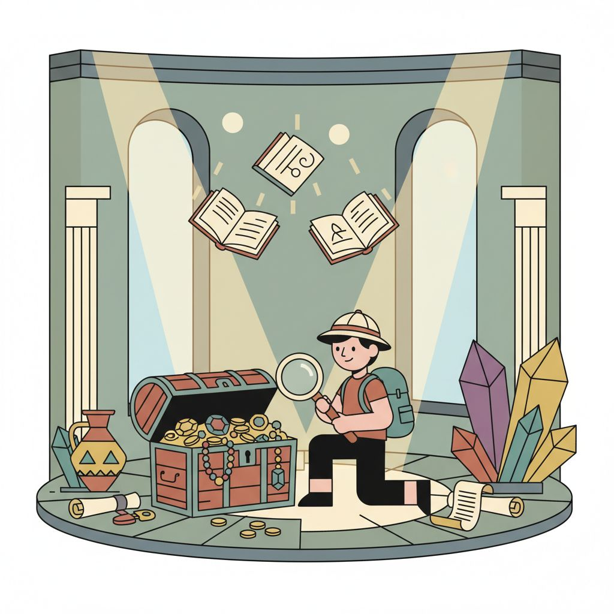

# Nano Banana Results ⚡

**Model:** `google/nano-banana`  
**Performance:** ⚡⚡ Very fast generation  
**Aspect Ratio:** ❌ Square format only (1024x1024)  
**Quality:** 🎯 Consistent artistic interpretation  

## Model Characteristics

- **Strength:** Ultra-fast generation with unique artistic style
- **Style Versatility:** Creative interpretation with artistic flair
- **Consistency:** Reliable square format output
- **Detail Level:** Good detail with distinctive artistic rendering
- **Generation Time:** ~3-5 seconds average per image
- **Format Limitation:** Cannot produce 16:9 aspect ratio

## Complete Style Gallery

*All images generated with the same base prompt for consistent comparison*

### Row 1: 3D & Animation Styles

| 3D Rendered Cartoon | Anime | Chibi |
|---------------------|-------|-------|
|  |  |  |
| Creative 3D interpretation with unique lighting | Distinctive anime style with creative proportions | Charming chibi with artistic interpretation |

**Style Prompt for 3D Rendered Cartoon:**
```
An exciting cartoon adventure scene featuring a brave young explorer discovering a hidden treasure chest in an ancient mystical library. The scene shows floating magical books, glowing crystals, ornate golden treasures spilling from an old wooden chest, with mystical light beams streaming through tall arched windows. Ancient scrolls and mysterious artifacts are scattered around, creating an atmosphere of wonder and discovery.

STYLE: High-quality 3D rendered cartoon style similar to Pixar/DreamWorks animation. Volumetric lighting with realistic shadows and reflections. Smooth, polished surfaces with subtle subsurface scattering. Rich depth of field with cinematic camera angles. Clean, professional 3D modeling with soft ambient occlusion. Vibrant colors with realistic material properties - romantic couple with expressive faces and realistic textures, workshop tools should have realistic metallic and wood materials.
```

| Pixar Style | Rubber Hose |
|-------------|-------------|
|  |  |
| Pixar-inspired with unique artistic twist | Creative take on classic 1930s animation |

### Row 2: Comic & Pop Culture Styles

| Comic Book | Pop Art | Cyberpunk Cartoon |
|------------|---------|-------------------|
|  |  |  |
| Dynamic comic style with creative flair | Bold pop art with unique interpretation | Creative cyberpunk aesthetic |

**Style Prompt for Pop Art:**
```
An exciting cartoon adventure scene featuring a brave young explorer discovering a hidden treasure chest in an ancient mystical library. The scene shows floating magical books, glowing crystals, ornate golden treasures spilling from an old wooden chest, with mystical light beams streaming through tall arched windows. Ancient scrolls and mysterious artifacts are scattered around, creating an atmosphere of wonder and discovery.

STYLE: Andy Warhol inspired pop art cartoon style with bold, vibrant colors and high contrast. Repetitive pattern elements and screen-print aesthetic. Flat color blocks with minimal shading. Bright, saturated colors like hot pink, electric blue, and lime green. Ben-day dot patterns and comic book-style halftones. Bold black outlines and simplified shapes. Celebrities and icons transformed into colorful cartoon characters.
```

### Row 3: Artistic & Fantasy Styles

| Fantasy Cartoon | Steampunk | Surreal Cartoon |
|-----------------|-----------|-----------------|
|  |  |  |
| Magical fantasy with creative interpretation | Steampunk with unique artistic vision | Highly creative surreal imagery |

**Style Prompt for Surreal Cartoon:**
```
An exciting cartoon adventure scene featuring a brave young explorer discovering a hidden treasure chest in an ancient mystical library. The scene shows floating magical books, glowing crystals, ornate golden treasures spilling from an old wooden chest, with mystical light beams streaming through tall arched windows. Ancient scrolls and mysterious artifacts are scattered around, creating an atmosphere of wonder and discovery.

STYLE: Salvador Dalí inspired surreal cartoon style with dream-like, impossible imagery. Melting clocks, floating objects, and gravity-defying elements. Exaggerated perspectives with infinite horizons and distorted proportions. Hybrid creatures combining multiple animals or objects. Impossible architecture with Escheresque stairs and optical illusions. Vivid, otherworldly colors and ethereal lighting. Elements should morph and blend into each other seamlessly.
```

| Watercolor Cartoon | Pastel Goth |
|--------------------|-------------|
|  |  |
| Artistic watercolor with unique technique | Gothic themes with creative pastel treatment |

### Row 4: Design & Illustration Styles

| Flat Illustration | Minimalist | Noir Cartoon |
|-------------------|------------|--------------|
|  |  |  |
| Clean flat design with creative elements | Elegant minimalist interpretation | Atmospheric noir with unique style |

**Style Prompt for Flat Illustration:**
```
An exciting cartoon adventure scene featuring a brave young explorer discovering a hidden treasure chest in an ancient mystical library. The scene shows floating magical books, glowing crystals, ornate golden treasures spilling from an old wooden chest, with mystical light beams streaming through tall arched windows. Ancient scrolls and mysterious artifacts are scattered around, creating an atmosphere of wonder and discovery.

STYLE: Modern flat illustration design with clean geometric shapes and bold, solid colors. No gradients, shadows, or 3D effects - purely flat design. Simple, iconic representations with minimal detail. Limited color palette of 4-5 complementary colors. Vector-style artwork with crisp edges and perfect curves. Emphasis on composition, balance, and negative space. Similar to modern app icons or infographic illustrations.
```

| Sketch Cartoon |
|-----------------|
|  |
| Creative hand-drawn sketch interpretation |

## 📊 Performance Metrics

- **Total Images:** 17/17 ✅ (100% success rate)
- **Generation Time:** 85 seconds total
- **Average per Image:** ~5.0 seconds
- **Speed:** 0.200 images/second (fastest tested!)
- **Aspect Ratio:** Square 1024x1024 pixels only
- **File Format:** JPEG, good quality
- **Concurrent Processing:** 300 requests handled efficiently

## 🎯 Style Analysis

**Best Performing Styles:**
- 🎨 **Artistic Styles**: Creative and unique interpretations
- 🌟 **Surreal & Fantasy**: Exceptional imagination and creativity
- ✏️ **Sketch & Flat**: Great understanding of simplified styles
- 🎭 **Pop Art**: Bold and distinctive visual results

**Unique Strengths:**
- Fastest generation speed of all tested models
- Unique artistic interpretation that stands out
- Consistent square format output
- Creative flair that adds personality to styles
- Excellent cost-per-image ratio

**Limitations:**
- ❌ No 16:9 aspect ratio support
- Limited to square format only
- Cannot be used for widescreen projects

**Model Recommendations:**
- ⚡ **Speed Champion**: Fastest generation available
- 🎨 **Creative Projects**: Unique artistic interpretations
- 💰 **Budget Friendly**: Most cost-effective option
- 🔄 **Rapid Prototyping**: Perfect for quick concept work

## 🔧 Technical Configuration Used

```python
files = await intelligent_batch_process(
    prompts=prompt_requests,
    model_name="google/nano-banana",
    max_concurrent=300,
    output_dir=model_output_dir,
    output_filepath=output_filepaths,
    num_outputs=1
    # Note: No aspect_ratio parameter - only supports square format
)
```

## 💡 Usage Tips

1. **Perfect for square formats** like Instagram posts
2. **Use for rapid prototyping** and concept development
3. **Great for artistic projects** where creativity matters most
4. **Cost-effective** for large batch generations
5. **Cannot produce 16:9** - use other models for widescreen

## ⚠️ Important Limitations

- **Square Format Only**: Cannot produce 16:9 or other aspect ratios
- **No Widescreen**: Not suitable for landscape/cinematic formats
- **Limited Parameters**: Fewer customization options than other models

## 🎯 Best Use Cases

- Square social media content
- Artistic experimentation
- Rapid concept generation
- Budget-conscious projects
- Creative interpretation needs

---

**[← Back to Qwen Results](./qwen-results.md)** | **[Back to Main Results →](../README.md)**