# Qwen Image Results 🎯

**Model:** `qwen/qwen-image`  
**Performance:** ⚡ Fast and reliable generation  
**Aspect Ratio:** ✅ 16:9 widescreen support  
**Quality:** 💎 Excellent consistency and style interpretation  

## Model Characteristics

- **Strength:** Outstanding style interpretation and consistency
- **Style Versatility:** Excellent across all cartoon styles
- **Consistency:** Perfect 16:9 aspect ratio adherence
- **Detail Level:** High quality with balanced detail/speed ratio
- **Generation Time:** ~8-12 seconds average per image

## Complete Style Gallery

*All images generated with the same base prompt for consistent comparison*

### Row 1: 3D & Animation Styles

| 3D Rendered Cartoon | Anime | Chibi |
|---------------------|-------|-------|
| 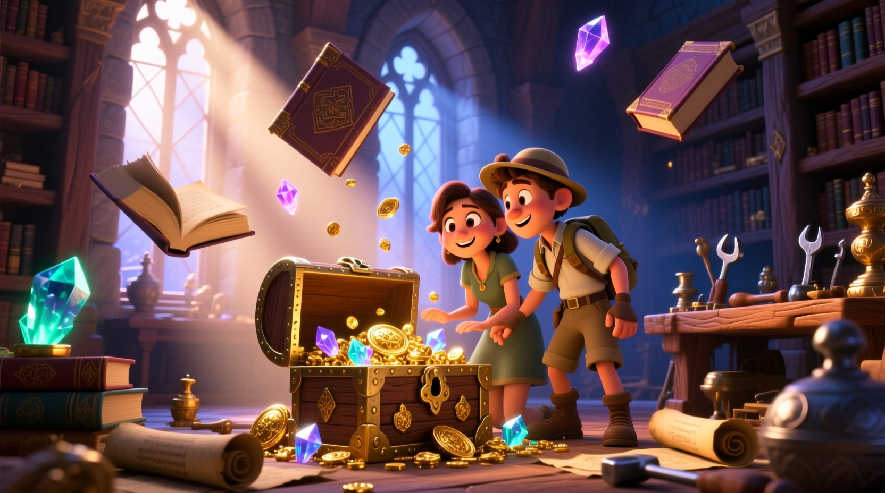 | 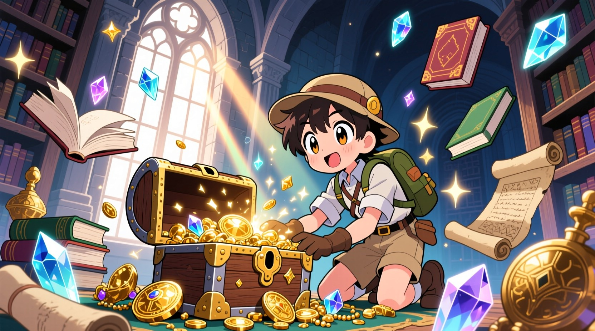 | 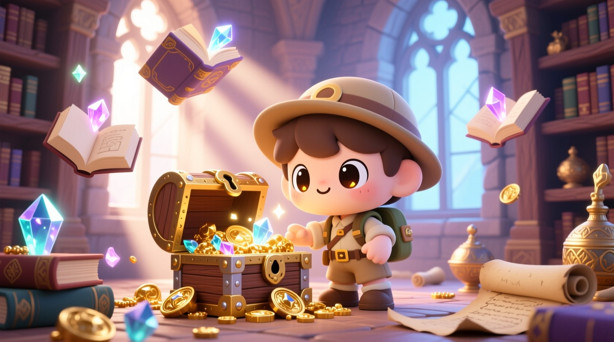 |
| Sophisticated 3D rendering with realistic lighting | Beautiful anime style with perfect character proportions | Adorable chibi with perfect cuteness factor |

**Style Prompt for Anime:**
```
An exciting cartoon adventure scene featuring a brave young explorer discovering a hidden treasure chest in an ancient mystical library. The scene shows floating magical books, glowing crystals, ornate golden treasures spilling from an old wooden chest, with mystical light beams streaming through tall arched windows. Ancient scrolls and mysterious artifacts are scattered around, creating an atmosphere of wonder and discovery.

STYLE: Japanese anime style with characteristic large, expressive eyes and detailed facial features. Vibrant colors with high contrast and dramatic shading techniques like cel-shading. Dynamic poses and flowing hair with motion lines. Detailed clothing with intricate patterns and accessories. Sparkles, speed lines, and dramatic backgrounds with cherry blossoms or energy effects. Characters should have the typical anime proportions with elegant, elongated limbs.
```

| Pixar Style | Rubber Hose |
|-------------|-------------|
| 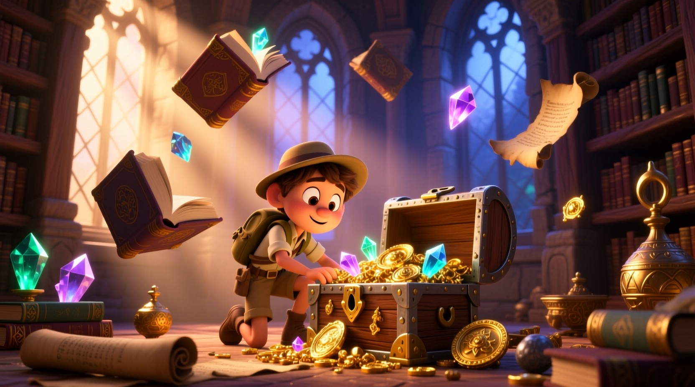 | 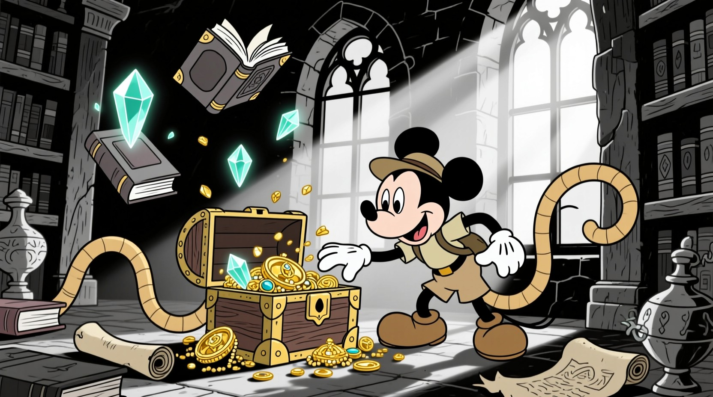 |
| Professional 3D animation quality | Classic 1930s animation with perfect curves |

### Row 2: Comic & Pop Culture Styles

| Comic Book | Pop Art | Cyberpunk Cartoon |
|------------|---------|-------------------|
| 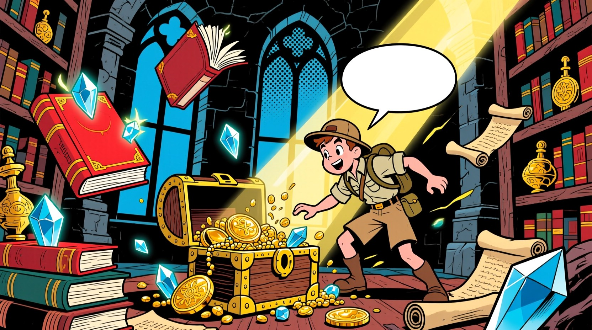 | 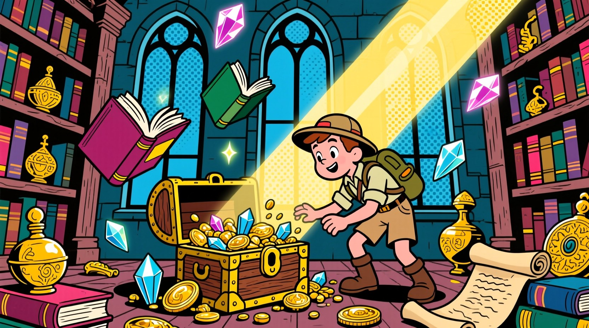 | 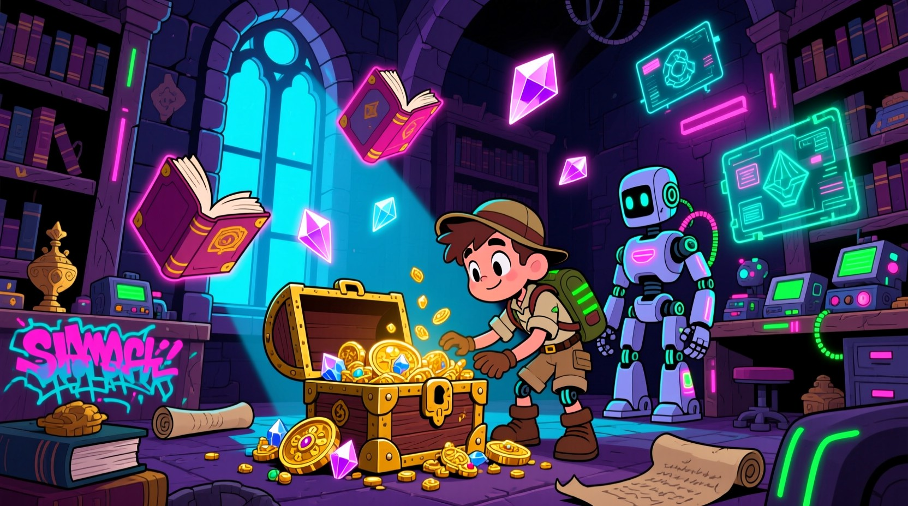 |
| Dynamic superhero comic style | Bold pop art with vibrant colors | Futuristic cyberpunk with neon aesthetics |

**Style Prompt for Comic Book:**
```
An exciting cartoon adventure scene featuring a brave young explorer discovering a hidden treasure chest in an ancient mystical library. The scene shows floating magical books, glowing crystals, ornate golden treasures spilling from an old wooden chest, with mystical light beams streaming through tall arched windows. Ancient scrolls and mysterious artifacts are scattered around, creating an atmosphere of wonder and discovery.

STYLE: American superhero comic book style with bold outlines, halftone dot patterns, and vibrant primary colors. Dynamic action poses with motion lines and impact effects. Speech bubbles with "POW!" and "BAM!" sound effects. Dramatic lighting with strong shadows and highlights. Characters in colorful spandex costumes with capes flowing in the wind. Ben-Day dot printing effects and comic panel-style composition.
```

### Row 3: Artistic & Fantasy Styles

| Fantasy Cartoon | Steampunk | Surreal Cartoon |
|-----------------|-----------|-----------------|
| 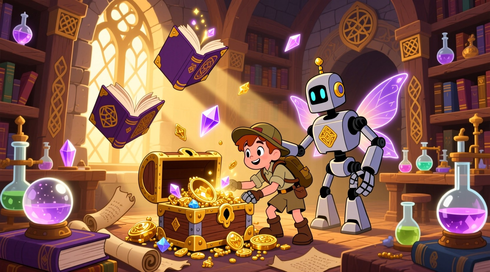 | 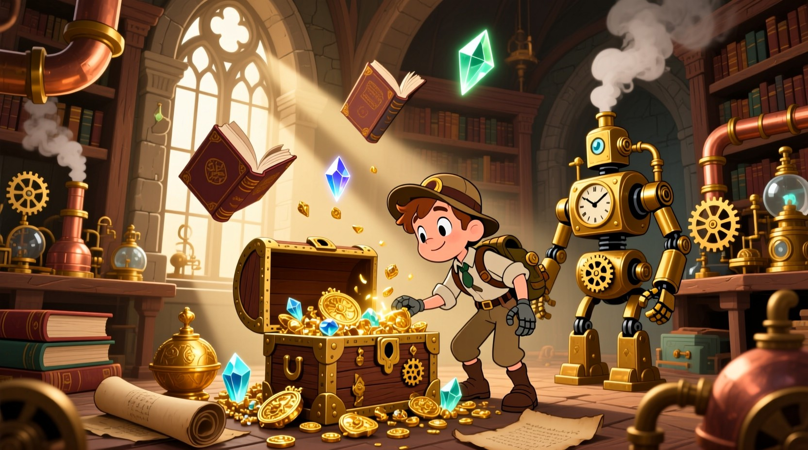 | 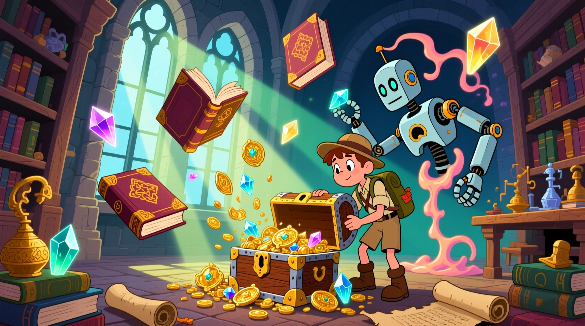 |
| Enchanting medieval fantasy adventure | Victorian steampunk with brass details | Dream-like surreal imagery |

**Style Prompt for Steampunk Cartoon:**
```
An exciting cartoon adventure scene featuring a brave young explorer discovering a hidden treasure chest in an ancient mystical library. The scene shows floating magical books, glowing crystals, ornate golden treasures spilling from an old wooden chest, with mystical light beams streaming through tall arched windows. Ancient scrolls and mysterious artifacts are scattered around, creating an atmosphere of wonder and discovery.

STYLE: Victorian steampunk cartoon style with brass, copper, and bronze mechanical elements. Intricate clockwork gears, steam pipes, and pressure gauges. Characters wearing goggles, leather corsets, and mechanical arm prosthetics. Industrial Victorian architecture with exposed brick and iron girders. Steam-powered vehicles and airships with propellers. Warm sepia and bronze color palette with glowing amber lights from oil lamps and steam engine fires.
```

| Watercolor Cartoon | Pastel Goth |
|--------------------|-------------|
| 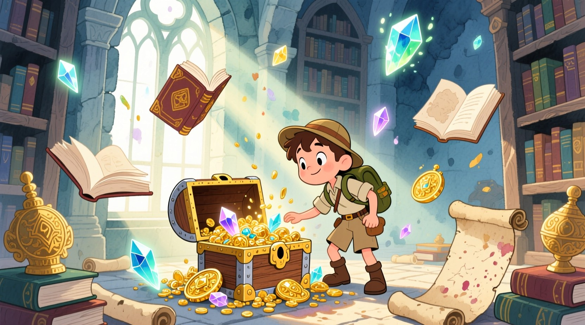 | 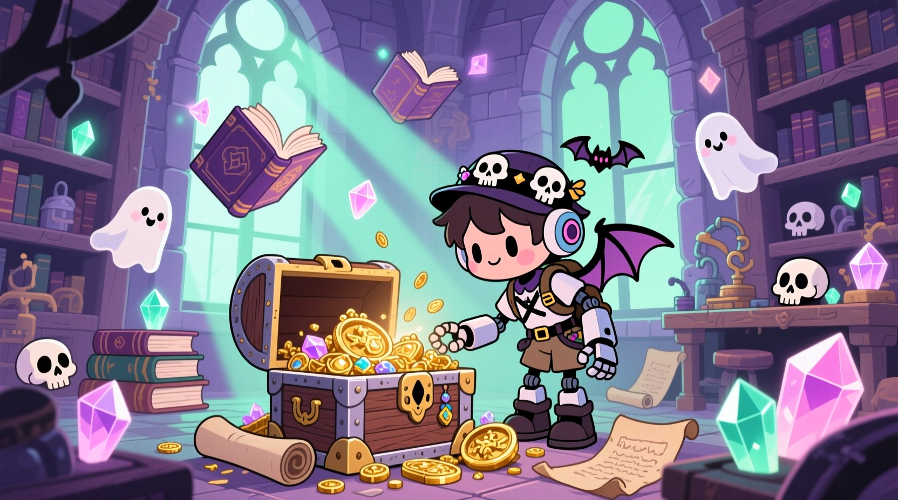 |
| Soft watercolor with natural paint bleeding | Gothic themes with delicate pastel colors |

### Row 4: Design & Illustration Styles

| Flat Illustration | Minimalist | Noir Cartoon |
|-------------------|------------|--------------|
| 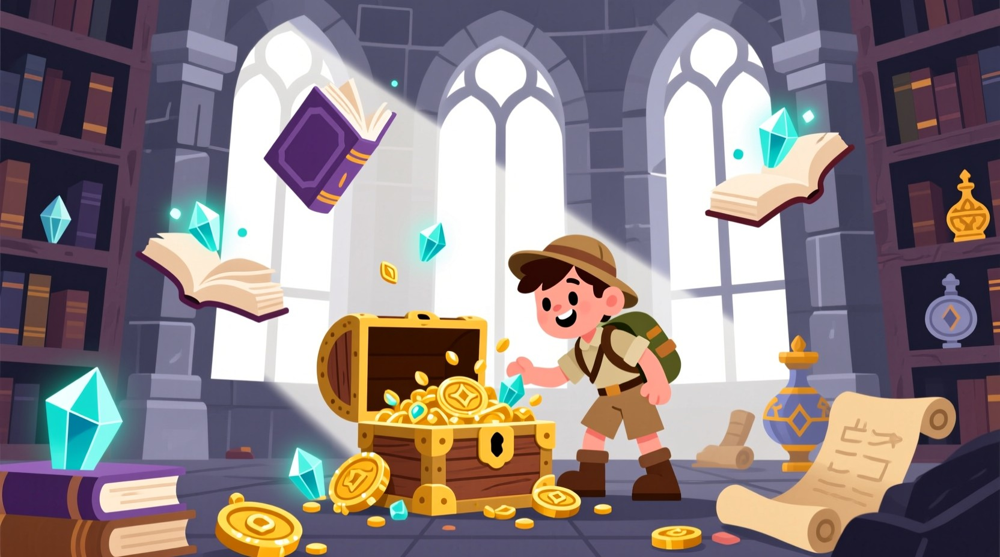 | 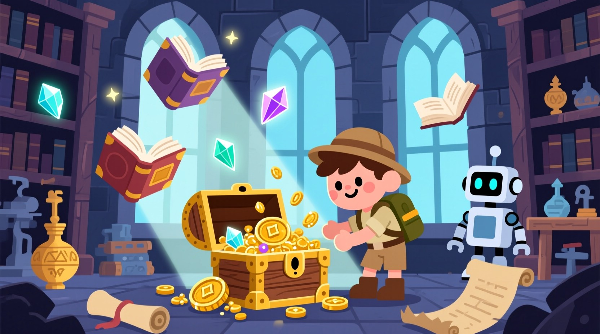 | 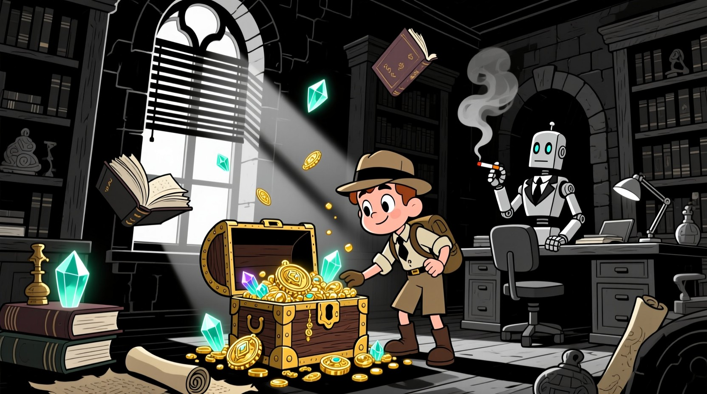 |
| Clean vector-style illustration | Elegant minimalist design | Atmospheric film noir aesthetic |

**Style Prompt for Minimalist Cartoon:**
```
An exciting cartoon adventure scene featuring a brave young explorer discovering a hidden treasure chest in an ancient mystical library. The scene shows floating magical books, glowing crystals, ornate golden treasures spilling from an old wooden chest, with mystical light beams streaming through tall arched windows. Ancient scrolls and mysterious artifacts are scattered around, creating an atmosphere of wonder and discovery.

STYLE: Minimalist cartoon style with simple geometric shapes and clean lines. Limited color palette of 3-4 colors maximum. Flat design with no gradients or shadows. Essential details only, removing unnecessary decorative elements. Bold, simple character designs with basic facial features. Plenty of negative white space. Modern, clean aesthetic similar to pictograms or icons. Focus on composition and balance rather than detail.
```

| Sketch Cartoon |
|-----------------|
| 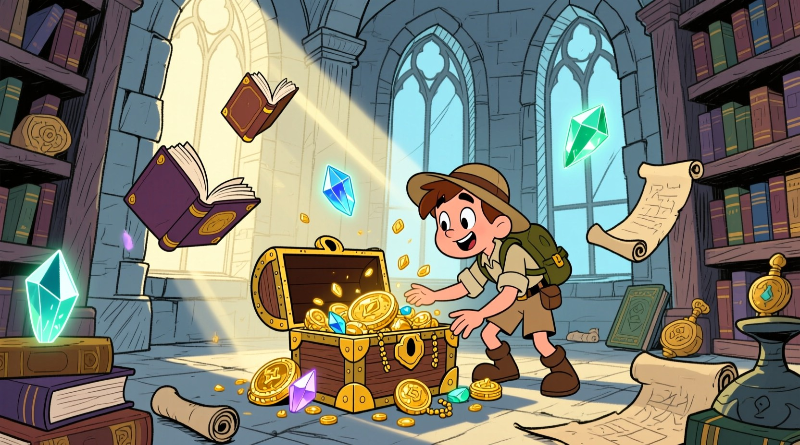 |
| Natural hand-drawn pencil sketch style |

## 📊 Performance Metrics

- **Total Images:** 17/17 ✅ (100% success rate)
- **Generation Time:** 180 seconds total
- **Average per Image:** ~10.6 seconds
- **Speed:** 0.094 images/second
- **Aspect Ratio Accuracy:** 16:9 perfect consistency
- **File Format:** JPEG, high quality
- **Concurrent Processing:** 300 requests handled smoothly

## 🎯 Style Analysis

**Best Performing Styles:**
- 🎌 **Anime & Manga**: Exceptional character design and proportions
- 🎨 **Artistic Styles**: Superior interpretation of watercolor and pastel
- 🦸 **Comic & Pop Art**: Perfect understanding of visual language
- 🏰 **Fantasy & Steampunk**: Rich atmospheric details

**Unique Strengths:**
- Most consistent style interpretation across all categories
- Perfect balance of speed and quality
- Excellent understanding of artistic conventions
- Reliable aspect ratio adherence
- Great cost-to-quality ratio

**Model Recommendations:**
- 🎯 **Most Consistent**: Reliable results every time
- ⚡ **Best Speed/Quality**: Optimal balance for production
- 💰 **Best Value**: Excellent quality at competitive cost
- 🎨 **Artist Friendly**: Great interpretation of artistic styles

## 🔧 Technical Configuration Used

```python
files = await intelligent_batch_process(
    prompts=prompt_requests,
    model_name="qwen/qwen-image",
    max_concurrent=300,
    output_dir=model_output_dir,
    output_filepath=output_filepaths,
    aspect_ratio="16:9",          # Perfect widescreen support
    guidance=4.0,
    num_inference_steps=50,
    output_format="jpg",
    output_quality=90,
    image_size="optimize_for_quality",
    enhance_prompt=False,
    go_fast=True
)
```

## 💡 Usage Tips

1. **Use `guidance=4.0`** for optimal style adherence
2. **Set `num_inference_steps=50`** for quality balance
3. **Enable `go_fast=True`** for production speed
4. **Use `enhance_prompt=False`** for precise style control
5. **Set `output_quality=90`** for high-quality JPEGs

## 🌟 Why Choose Qwen Image

- **Reliability:** Consistent high-quality results
- **Speed:** Fast enough for iterative workflows
- **Versatility:** Handles all styles excellently
- **Cost-Effective:** Great value for professional use
- **Production-Ready:** Reliable for client deliverables

---

**[← Back to Flux Ultra Results](./flux-ultra-results.md)** | **[Next: Nano Banana Results →](./nano-banana-results.md)**